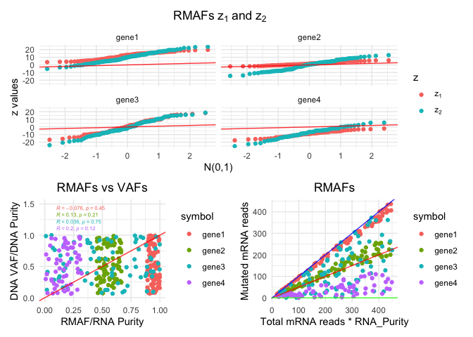

RMAFster
================

<!-- README.md is generated from README.Rmd. Please edit that file -->

RMAfster allows to calculate RNA mutated allele frequencies (RMAFs)
given a list of mutations and RNA-seq BAM files.

## Installation

You can install the development version from github using devtools:

``` r
# install.packages("devtools")
devtools::install_github("fcaramia/RMAFster")
```

## Basic example

``` r
library(RMAFster)
#> RMAFster uses a local python environment to execute RmafsterCalc,
#>   unless you specify a python environment using reticule::use_...
#>   you will be prompted to install miniconda the first time you use RmasterCalc.
#>   Select (Y) to proceed. Python dependencies will be handled automatically
samples = data.frame(
               sample_id='CT26',
               bam_path=system.file("extdata","CT26_chr8_115305465.bam",
               package = 'RMAFster', mustWork=TRUE),
               purity=1,
               stringsAsFactors = FALSE)
mutations = data.frame(
                 chr='chr8',
                 pos=115305465,
                 ref='G',
                 alt='A',
                 sample_id='CT26',
                 symbol ='Cntnap4')
rmafs = RmafsterCalc(
     mutations,
     samples
)
#> Warning in RmafsterCalc(mutations, samples): var column not found in mutation
#> file, using SNP for all mutations
#> Warning in RmafsterCalc(mutations, samples): vaf column not found in mutation
#> file, using 0.5 for all mutations
#> Warning in RmafsterCalc(mutations, samples): dna_dp column not found in mutation
#> file, using 200 for all mutations
```

Once RMAFs are calculated you can quickly explore them and compare
groups of genes/samples/etc..

``` r
rmafs = data.frame(
            rmaf = c(sample(800:1000,100,replace = TRUE)/1000,
                      sample(400:600,90,replace = TRUE)/1000,
                      sample(0:1000,80,replace = TRUE)/1000,
                      sample(0:300,60,replace = TRUE)/1000,
                      sample(1:1000,10,replace = TRUE)/1000
                     ),
            purity = c(rep(1,340)),
            rna_dp = c(sample(20:500,340,replace = TRUE)),
            dna_dp = c(sample(100:500,340,replace = TRUE)),
            vaf = c(sample(50:1000,340,replace = TRUE)/1000),
            symbol = c(rep('gene1',100),
                       rep('gene2',90),
                       rep('gene3',80),
                       rep('gene4',60),
                       rep('gene5',10)),
             stringsAsFactors = FALSE
               )

RmafsterExpl(
     rmafs,
     'symbol',
     20,
     print_plot = TRUE
)
```

<!-- -->

    #> # A tibble: 330 x 9
    #>    symbol n_muts  rmaf purity rna_dp dna_dp   vaf    z1    z2
    #>    <chr>   <int> <dbl>  <dbl>  <int>  <int> <dbl> <dbl> <dbl>
    #>  1 gene1     100 0.827      1    199    258 0.863  9.23 -1.06
    #>  2 gene1     100 0.97       1    279    345 0.119 15.7  21.1 
    #>  3 gene1     100 0.904      1    414    101 0.334 16.4  12.7 
    #>  4 gene1     100 0.867      1    338    426 0.615 13.5   7.76
    #>  5 gene1     100 1          1    129    462 0.224 11.4  16.0 
    #>  6 gene1     100 0.986      1     32    242 0.32   5.50  7.23
    #>  7 gene1     100 0.972      1     61    266 0.164  7.37 12.3 
    #>  8 gene1     100 0.954      1    473    241 0.544 19.7  13.4 
    #>  9 gene1     100 0.926      1    191    420 0.126 11.8  18.9 
    #> 10 gene1     100 0.8        1    415    425 0.454 12.2  10.4 
    #> # … with 320 more rows
