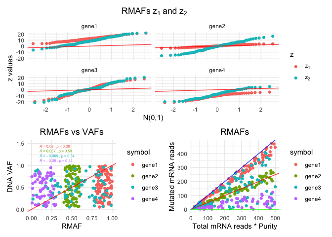

RMAFster
================

RMAFster
--------

RMAfster allows to calculate RNA mutated allele frequencies (RMAFs) given a list of mutations and RNA-seq BAM files.

Installation
------------

You can install the development version from github using devtools:

``` r
# install.packages("devtools")
devtools::install_github("fcaramia/RMAFster")
```

Basic example
-------------

``` r
library(RMAFster)
```

    ## RMAFster uses a local python environment to execute RmafsterCalc,
    ##   unless you specify a python environment using reticule::use_...
    ##   you will be prompted to install miniconda the first time you use RmasterCalc.
    ##   Select (Y) to proceed. Python dependencies will be handled automatically

``` r
samples = data.frame(
               sample_id='CT26',
               bam_path=system.file("extdata","CT26_chr8_115305465.bam",
               package = 'RMAFster', mustWork=TRUE),
               purity=1,
               stringsAsFactors = FALSE)
mutations = data.frame(
                 chr='chr8',
                 pos=115305465,
                 ref='G',
                 alt='A',
                 sample_id='CT26',
                 symbol ='Cntnap4')
RmafsterCalc(
     mutations,
     samples
)
```

    ## Warning in RmafsterCalc(mutations, samples): var column not found in mutation
    ## file, using SNP for all mutations

    ## Warning in RmafsterCalc(mutations, samples): vaf column not found in mutation
    ## file, using 0.5 for all mutations

    ## Warning in RmafsterCalc(mutations, samples): dna_dp column not found in mutation
    ## file, using 200 for all mutations

    ##    chr       pos ref alt sample_id  symbol var vaf dna_dp ref_alleles
    ## 1 chr8 115305465   G   A      CT26 Cntnap4 SNP 0.5    200           5
    ##   alt_alleles other_alleles purity rna_dp rmaf
    ## 1           5             0      1     10  0.5

Once RMAFs are calculated you can quickly explore them and compare groups of genes/samples/etc..

``` r
rmafs = data.frame(
            rmaf = c(sample(800:1000,100,replace = TRUE)/1000,
                      sample(400:600,90,replace = TRUE)/1000,
                      sample(0:1000,80,replace = TRUE)/1000,
                      sample(0:300,60,replace = TRUE)/1000,
                      sample(1:1000,10,replace = TRUE)/1000
                     ),
            purity = c(rep(1,340)),
            rna_dp = c(sample(20:500,340,replace = TRUE)),
            dna_dp = c(sample(100:500,340,replace = TRUE)),
            vaf = c(sample(50:1000,340,replace = TRUE)/1000),
            symbol = c(rep('gene1',100),
                       rep('gene2',90),
                       rep('gene3',80),
                       rep('gene4',60),
                       rep('gene5',10)),
             stringsAsFactors = FALSE
               )

RmafsterExpl(
     rmafs,
     'symbol',
     20,
     print_plot = TRUE
)
```



    ## # A tibble: 330 x 9
    ##    symbol n_muts  rmaf purity rna_dp dna_dp   vaf    z1     z2
    ##    <chr>   <int> <dbl>  <dbl>  <int>  <int> <dbl> <dbl>  <dbl>
    ##  1 gene1     100 0.935      1    304    477 0.666 15.2   8.72 
    ##  2 gene1     100 0.801      1    305    135 0.223 10.5  11.5  
    ##  3 gene1     100 0.8        1    164    265 0.413  7.68  7.85 
    ##  4 gene1     100 0.874      1    307    280 0.277 13.1  14.7  
    ##  5 gene1     100 0.852      1    156    212 0.153  8.79 13.3  
    ##  6 gene1     100 0.94       1     66    178 0.731  7.15  3.55 
    ##  7 gene1     100 0.97       1    136    113 0.603 11.0   7.26 
    ##  8 gene1     100 0.829      1    323    342 0.649 11.8   5.27 
    ##  9 gene1     100 0.887      1    248    183 0.901 12.2  -0.465
    ## 10 gene1     100 0.875      1    347    222 0.644 14.0   6.54 
    ## # … with 320 more rows
